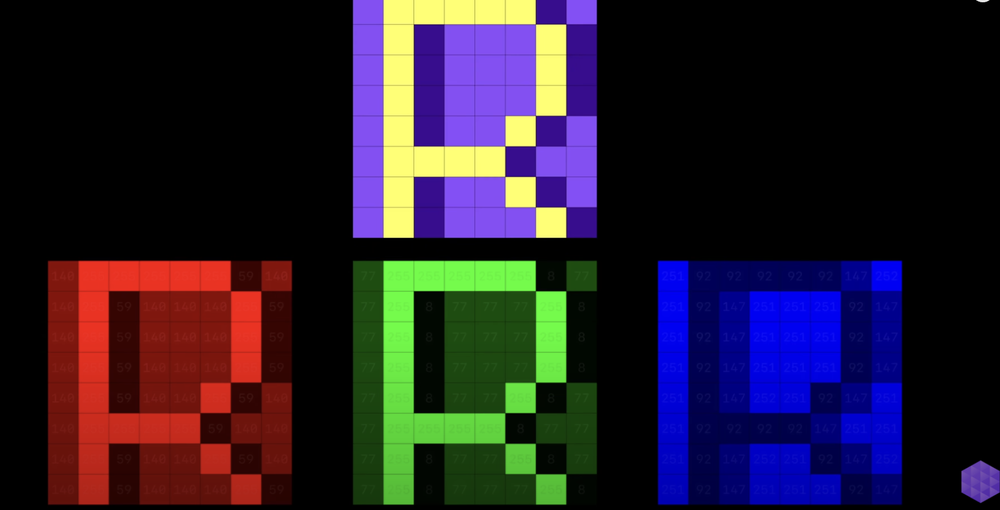
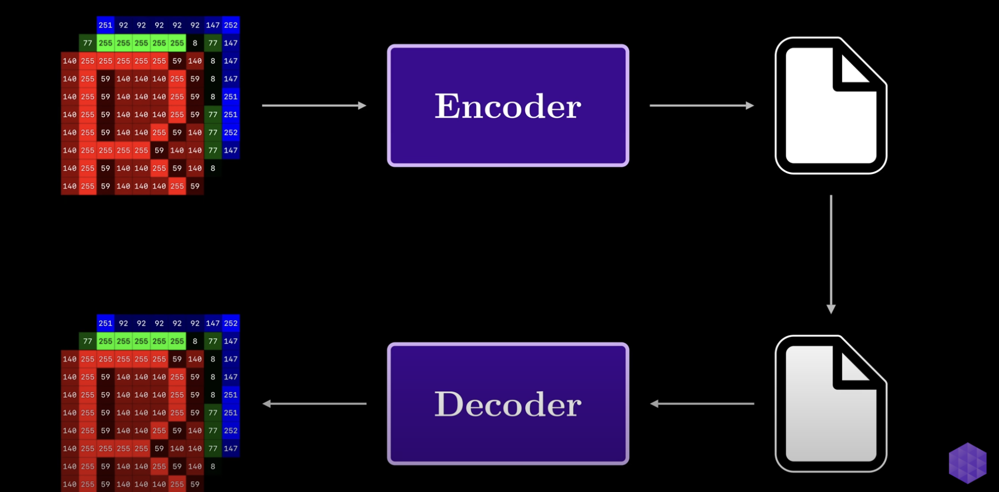
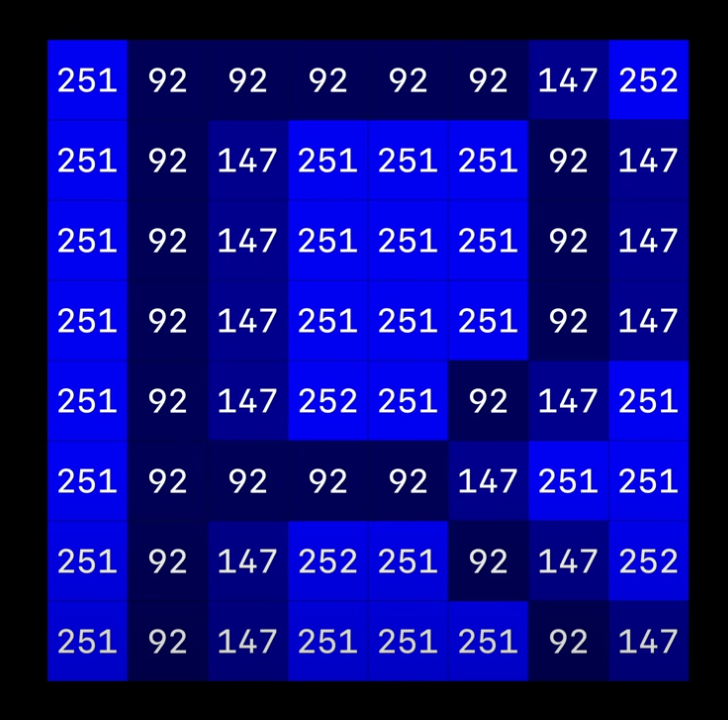
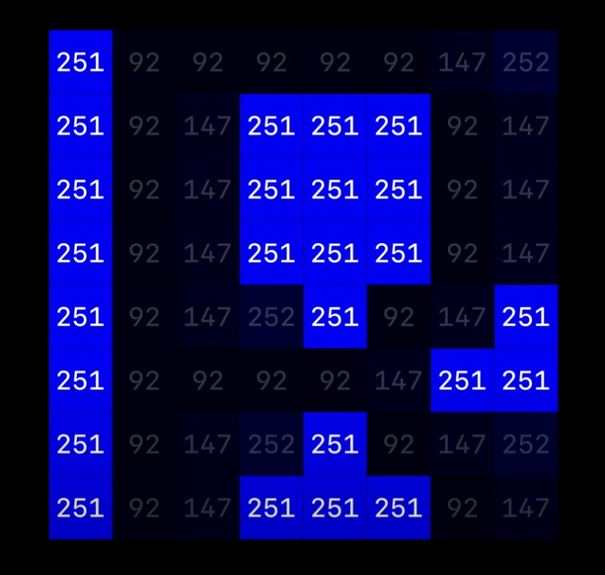
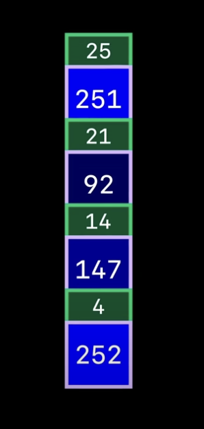
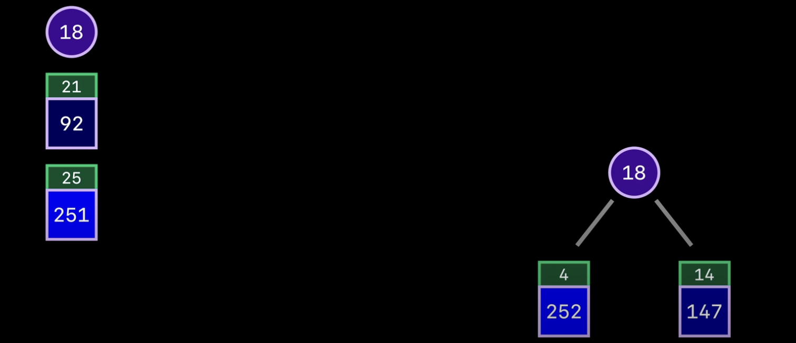

## 前言
本节我们主题是深入了解PNG图片格式的工作原理，了解是其是如何通过一种相当巧妙方法压缩图像从而在所有网站上保留最原始的图像质量。下面是源视频可参考。
> [How PNG Works: Compromising Speed for Quality](https://www.youtube.com/watch?v=EFUYNoFRHQI)

平时我们最常用的图片格式就是`png`和`jpeg`。 `jpeg`一个非常常见的问题就是一些特定的图像在压缩后会出现一些伪像（如下图），特别是当这些图像中具有矢量图形或文本时，这些伪像是`jpeg` 为了节省更多空间故意丢弃的信息。 `png`就没有这样的问题，本节的主题就是从无损压缩的角度理解`png`。

## png的实现原理
想象给一张由红绿蓝色素组成的图像，并要求将图像压缩到尽可能少的位数。

一个关键的约束是无论你使用哪种压缩算法，都必须有一种办法将其反转并返回完全相同的图像。相同数量的素，并且像素一一对应，你在多大程度上解决问题，无损压缩中常见的一个想法是利用冗余。

下面让我们专注于这个图像中的一个通道，以在这个特定通道中找到比其他像素更常见，保持简单。也许我们可以利用这一点更少的空间来表示。

如果不熟悉霍夫曼代码，我们可以独立获取像素并可以图像中像素的频率，我们按照升序将这些频率进行排序。

